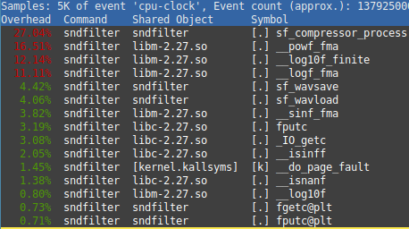
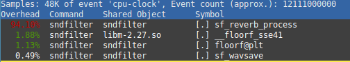
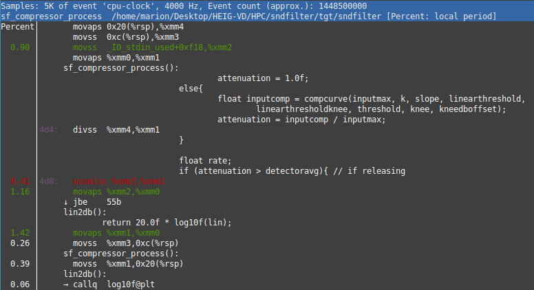
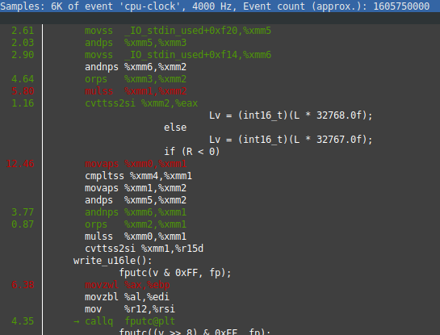

# HPC - Projet 1 : Optimisation du logiciel sndfilter

Auteur : Marion Dutu Launay

Date : 7 juin 2020

## Description du logiciel

Sndfilter est un logiciel open-source développé par Sean Connelly, dont les sources sont disponibles sur GitHub (lien dans les Sources). Il met à disposition différents filtres sonores, implémentés en C, que l'on peut appliquer sur un fichier au format `.wav` de notre choix. Voici la liste des filtres qui sont proposés :

- réverbération
- compresseur
- passe-bas et passe-haut
- passe-bande et coupe-bande
- égaliseur
- all-pass
- low shelf et high shelf

Chaque filtre s'utilise avec différents paramètres propres à chacun (fréquence, résonnance, gain...) dont la liste est disponible en lançant l'exécutable sans paramètres (`./sndfilter`). Il en résulte un second fichier `.wav` dont les données ont été modifiées après l'application du filtre sélectionné.

## Motivations

Pour ce premier travail personnel d'HPC, mon but était de trouver un projet écrit en langage C, car c'est le langage que je connais le mieux et que nous avons utilisé en cours d'HPC. Ainsi, j'ai plus de chances de pouvoir apporter ma contribution au projet existant sans trop de difficultés.

Je souhaitais également travailler sur un projet ayant une petite renommée afin de rendre le travail plus stimulant, et j'ai donc cherché des dépôts publics sur GitHub avec différents mots-clés, triés par ordre décroissant du nombre de Stars (190 pour le mien !). En laboratoire de Systèmes audio-vidéo au semestre précédent, cela m'avait plu d'appliquer des filtres sonores sur des musiques, c'est pourquoi mon choix s'est porté sur ce projet. De plus, avec ce type de logiciel, la procédure de vérification est courte : il est facile et rapide de se rendre compte du résultat produit par de potentielles améliorations, et de vérifier que l'algorithme est toujours fonctionnel en écoutant le fichier audio en sortie.

Après avoir installé et testé le logiciel en utilisant quelques filtres sonores sur une musique libre de droits, j'ai pu observer que l'application des filtres sur les données audio prenait un temps considérable. Ainsi, bien qu'ayant une piètre connaissance de certains algorithmes utilisés dans le projet, j'ai fait l'hypothèse que des améliorations de performances étaient possibles en se servant des différents outils vus en cours, le programme traitant une certaine quantité de données selon la longueur de la musique (3 min 35 pour celle que j'utilise).

## Procédure d'installation

Pour commencer, il est nécessaire de cloner le dépôt GitHub afin de disposer des fichiers nécessaires à la construction de l'exécutable. Ensuite, il suffit d'exécuter le script `build` situé à la racine, qui compile les fichiers en utilisant le compilateur clang (il est donc nécessaire de l'avoir à disposition) L'exécutable créé se trouvera ensuite dans un nouveau dossier `tgt`.

Les arguments passés à l'exécutable diffèrent selon le type de filtre que l'on souhaite appliquer, c'est pourquoi une liste des options est accessible si l'on exécute simplement la commande `./sndfilter` sans arguments.

## Stratégie de benchmarking, outils et résultats

Tout au long du processus de benchmarking et d'améliorations, j'ai utilisé le même fichier comme d'entrée (lien dans les Sources).

Comme il y a de nombreux filtres mis à disposition, j'ai préféré me concentrer sur deux d'entre eux pour le benchmarking, à savoir la réverbération et le compresseur. Je les ai utilisés avec des valeurs un peu arbitraires, pour autant que l'effet s'entende en sortie sans faire souffrir les tympans de l'auditeur : `0.5 largehall1` pour `reverb` et `20 -50 40 20 0 0` pour `compressor` (à écouter quand même avec un volume plutôt bas :) ). Le premier est assez long à s'exécuter sur le fichier de référence (plus de 20 secondes), le second plutôt rapide (moins de 5 secondes).

Afin de benchmarker le programme de base, j'ai utilisé l'outil de profiling `perf stat` qui me permet de récolter quelques informations de référence basiques sur les performances actuelles du logiciel. Voici un tableau récapitulatif de cette étape :

| Events               | reverb        | compressor    |
| -------------------- | ------------- | ------------- |
| cpu-clock (msec)     | 29'795.16	   | 1'888.04      |
| cache-references (#) | 140'117'010   | 16'154'438    |
| cache-misses (%)	   | 15.488		   | 69.669        |
| page-faults (#)	   | 37'396		   | 37'098        |

Ensuite, j'ai utilisé `perf record` sur ces mêmes évènements afin de cibler les opérations problématiques. J'ai ajouté au script `build` l'option `-g` afin de visualiser le code C et le code assembleur résultant avec `perf report`, pour analyser plus efficacement le code. Je peux ainsi repérer dans le code assembleur certaines lignes que `perf` a surligné en rouge, et je peux retrouver ces opérations dans le code C pour lister ce qui pourrait être amélioré.

Je ne me suis intéressée qu'à l'annotation de l'event `cpu-clock`, car cela offrait déjà beaucoup d'informations, et la métrique que je souhaite améliorer est le temps d'exécution du programme.

Voici un classement des fonctions gourmandes en temps d'exécution pour le filtre `compressor` :

Ici, nous pouvons voir que 3 fonctions provenant de la `libm` en lien avec des opérations mathématiques sont dans le top 4 ; ce n'est donc pas un code que je pourrais améliorer, mais je peux m'intéresser aux deux autres fonctions.

Voici le même classement pour le filtre `reverb` :

## Analyse du benchmarking et idée d'optimisation

Après avoir détaillé le rapport de `perf` en annotant les différentes fonctions, je peux voir que le filtre `compressor` utilise des opérations assembleur très gourmandes plutôt isolées, alors que `reverb` en utilise une grande quantité mais la charge est assez répartie.

Avant de me lancer dans une analyse détaillée du code C en lien avec ces opérations assembleur problématiques, j'ai ouvert le script `build` afin d'analyser la façon dont l'exécutable était construit avec clang. J'ai constaté qu'aucune option d'optimisation n'était activée.

## Implémentation de l'optimisation

Une première action à effectuer serait donc d'ajouter un `-O<n>` aux options du compilateur, avec `n` entre 1 et 3 selon le niveau souhaité. Pour commencer, je préfère mettre toutes les chances de mon côté et donc activer directement le niveau 3.

## Benchmarking de l'optimisation

Après avoir activé le niveau 3 d'optimisation au compilateur, voici ce que donne `perf stat` sur les mêmes évènements que ceux de l'analyse préliminaire :

| Events               | reverb        | compressor    |
| -------------------- | ------------- | ------------- |
| cpu-clock (msec)     | 11'913.22	   | 1'371.94      |
| cache-references (#) | 167'109'912   | 16'369'207    |
| cache-misses (%)	   | 22.338		   | 68.834        |
| page-faults (#)	   | 37'394		   | 37'097        |

Grâce à ces statistiques, nous pouvons voir qu'à présent l'application du filtre `reverb` ne prend plus qu'un tiers du temps qu'il prenait avant l'optimisation. Il est intéressant de constater qu'apparemment le prix à payer pour réduire le temps d'exécution était d'augmenter le nombre de `cache-references` et de `cache-misses`. L'application du filtre `compressor` a également légèrement réduit en temps d'exécution.

N'étant pas tout à fait satisfaite de cette contrepartie, j'essaie de descendre d'un niveau d'optimisation afin de voir si les statistiques récoltées peuvent changer de valeur. Voici ce que donne `perf stat` avec le niveau d'optimisation `-O2` :

| Events               | reverb        | compressor    |
| -------------------- | ------------- | ------------- |
| cpu-clock (msec)     | 11'056.93	   | 1'339'57      |
| cache-references (#) | 116'060'500   | 16'956'695    |
| cache-misses (%)	   | 11.189		   | 64.485        |
| page-faults (#)	   | 37'395		   | 37'094        |

Ici, nous pouvons constater qu'en plus de réduire le temps d'exécution, le taux de cache-misses a également réduit pour les deux applications de filtre, et que le nombre de cache-references a réduit pour le reverb ; le niveau d'optimisation 2 semble donc plus adapté à ce type de programme.

Après m'être renseignée sur les différences entre les niveaux d'optimisation du compilateur clang, j'apprends qu'il est courant que le niveau 3 d'optimisation peut parfois engendrer une réduction des performances selon les opérations effectuées. En effet, `-O2` ne prend pas le risque d'augmenter la taille de l'exécutable ou de dégrader les performances, ce qui n'est pas le cas de `-O3`.

Pour le "fun", je regarde ce que donne le niveau 1 :

| Events               | reverb        | compressor    |
| -------------------- | ------------- | ------------- |
| cpu-clock (msec)     | 14'774.90	   | 1'557'60      |
| cache-references (#) | 168'460'389   | 19'123'773    |
| cache-misses (%)	   | 28.789		   | 64.308        |
| page-faults (#)	   | 37'397		   | 37'098        |

Comme le taux de cache-misses a beaucoup augmenté et le temps d'exécution n'a pas changé dans le bon sens, le gagnant reste le niveau 2 ; le flag `-Ofast` donne des résultats similaires au niveau 3.

Après avoir recompilé le tout avec le niveau d'optimisation 2, j'effectue des `perf record` comme lors de l'analyse du début afin de voir comment le code assembleur a été modifié après les optimisation effectuées par le compilateur. Je m'intéresse notamment à détecter si les opérations problématiques décelées auparavant sont toujours présentes. Bien que ce soit toujours le cas pour certaines, l'ajout du niveau d'optimisation `-O2` a supprimé certaines lignes qui posaient problème.

Par exemple, une ligne persistante est une opération de comparaison `ucomiss` dans l'application du filtre compressor qui prend un temps considérable :

Cette opération est engendrée par une comparaison dans le code C de deux opérandes de type float, dans le fichier `compressor.c`. Après avoir parcouru le code en lien avec cette comparaison, je fais l'hypothèse qu'elle est essentielle au bon déroulement du programme et je ne cherche pas à la supprimer.

Après ceci, la deuxième fonction (qui ne provient pas d'une librairie externe) du top 5 des fonctions gourmandes en temps est `sf_wavsave` du fichier `wav.c`, et les opérations assembleur problématiques qui persistent sont les suivantes :

En remplaçant l'opérande droite des 4 multiplications par son équivalent en int et non en float (car de toute façon le résultat est casté en `int16_t`), cette fonction n'est plus en rouge dans le top des fonctions problématiques. Cela dit après quelques tests, j'ai réalisé que la différence de performance n'était pas mesurable, ce n'est donc pas une amélioration très utile dans ce cas.

## Conclusion

Pour conclure, j'ai apprécié effectuer ce mini-projet : il était intéressant de pouvoir chercher des améliorations dans un code existant, et de bénéficier d'une grande liberté pour les implémenter. De plus, j'ai pu revoir l'ensemble de mes compétences d'HPC pour choisir laquelle était la mieux adaptée à ce type de programme.

Même si je n'ai pas beaucoup modifié le code existant, j'ai pu apprendre des choses, notamment le fait que choisir le niveau d'optimisation du compilateur au maximum n'est pas toujours adapté à ce que l'on veut obtenir.

La fin du semestre étant chargée, je n'ai pas pu me pencher en détail sur tout le code à ma disposition, qui semble très riche et qui traite une grande quantité de données. Il est sûrement possible d'améliorer des choses que le compilateur ne peut pas faire, notamment utiliser des instructions SIMD, ou encore faire du multithreading avec OpenMP, mais cela nécessiterait une analyse détaillée du code, qui reste très dense.

## Sources

Lien vers le dépôt officiel : https://github.com/voidqk/sndfilter

Développeur du logiciel : https://sean.cm/

Fichier utilisé (morceau) : https://www.free-stock-music.com/jayjen-osheen-holiday.html
